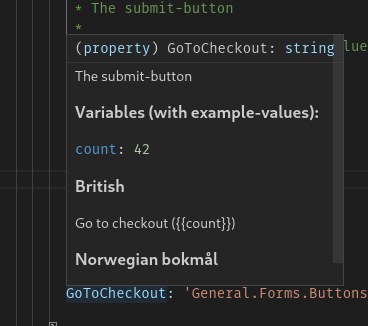
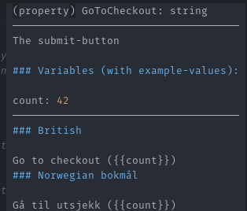

# Skiver

## Current feature-set

### Exports

You own your data. At any time, you can export all information recorded, and convert it to any supported format.

#### Extended typescript-support

The types generated for use in typescript-projects gives a better insight for developers as to what each key in the translation means.

Depending on the tooling used, developers could only see the key for the translation, with very limited information about the meaning of the key without consulting
a different system.

With these types generated, the developer can see examples of the real translation directly in their editor, along with any parameters used.

<div style="width: 100%; display: flex; gap: 20px; flex-direction: row; align-items: flex-end;">

<div>



*Hover-information in Visual Studio Code*

</div>

<div>




*Tooltip in VIM*

</div>
</div>

- [X] Multi-locale support
- [X] Multi-project support
- [X] i18n-compliant export
- [X] Auto-translate via external translation-service (Bing Translate, Libre Translate)

- [X] Report missing translation
  - [X] Missing translations can easily be viewed and created from the UI.
- [X] Typescript-type-generation with rich comments
- [X] Import translations
  - [X] General AST
  - [X] Dry run, with preview of updates and creations
  - [X] `i18next`-format
    - [X] multiple-language 
    - [X] context-support
    - [X] inferring of variables and nested keys. 
- [X] Multi-organization support

## Planned feature-set

- [ ] Server-side interpolation via API
- [X] Client-side live interpolation via library
  - [ ] Support for multiple libraries, including different versions.
  - [ ] Optionally bring your own library, per project. Upload any WebAssembly with the library included, and it will be used on all translations.
- [ ] Source-code integration with project, to show usage of translation.
      
     E.g.
     
     > This translation is used in SuperComponent.svelte:74:
       ```jsx
       73: <div>
       74:   <p>{t("feature.awesome", {count: 6})}
       75: </div>
       ```
- [ ] Upload of images to show usage of translation.
- [ ] Sharing of translations between projects.


## Things that are a mess, and need refactoring

- Missing translations. They work, but they are terrible. It comes mostly from not trusting the user-input, 
while still attempting to resolve this untrusted information.


## Swagger and code-generation

We use swagger, with [go-swagger](https://goswagger.io/) for both generating
parts of the Swagger 2.0-document, and for providing Go-Models for server-use
as well as typescript-models for frontend.

The base-swagger is extended with code-generation, and can be used to manually 
define parts of the swagger-file.

This information includes base-information like application description, versioning
etc, routing and user-input (parameters).

The generated user-input-models are output into `./models`.

Extra types are generated from the go-structs itself, and lives in the `./types`-package.

### Committing generated files

Although some people prefer not to commit generated files, the generated swagger files with
models etc. should in this project be committed like any other file.

This makes it a lot easier to reason about changes, and we are then not at the mercy of 
code-generation. We still can at any point drop out of using code-generation for parts of, 
or the whole schema.


